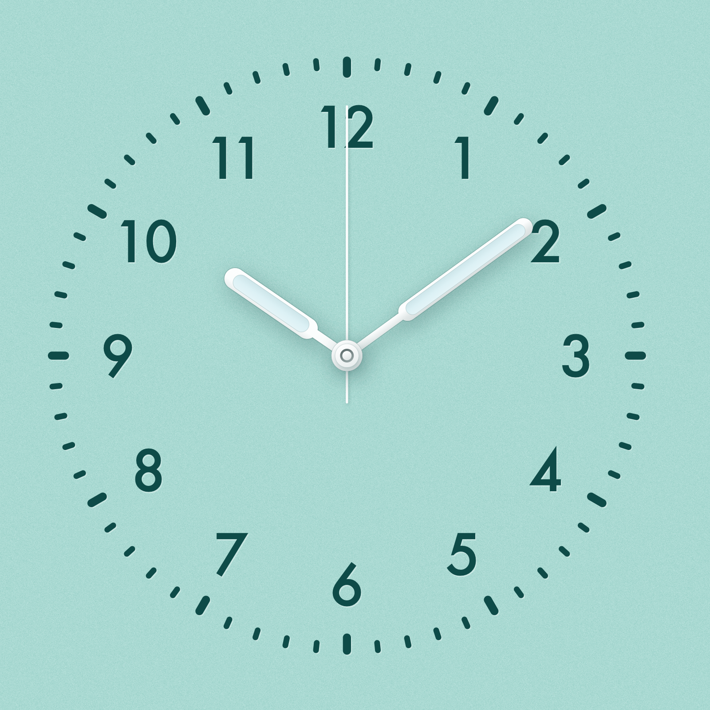
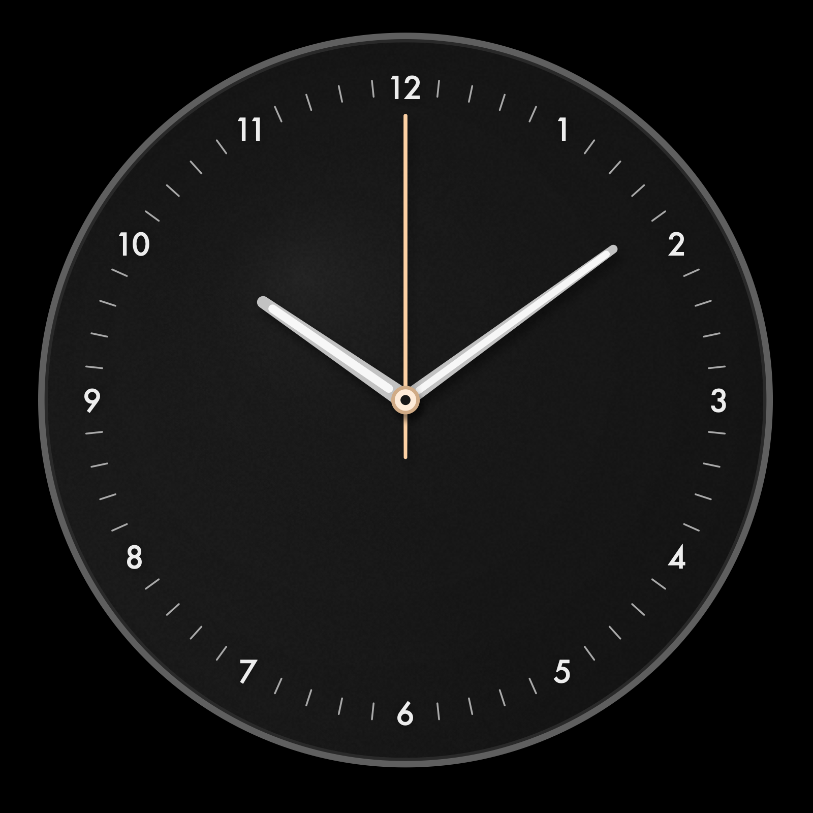
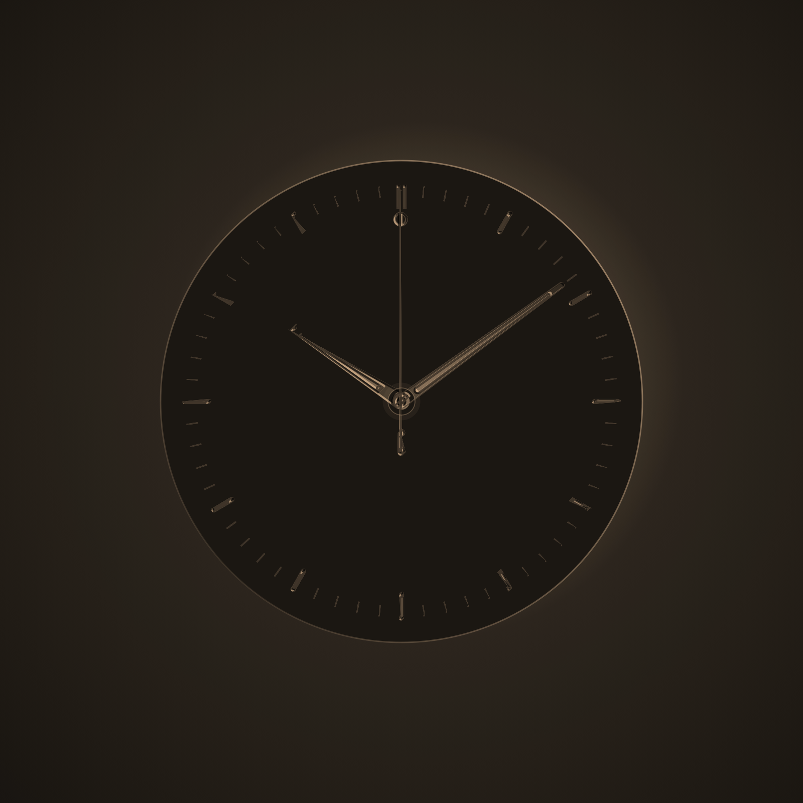
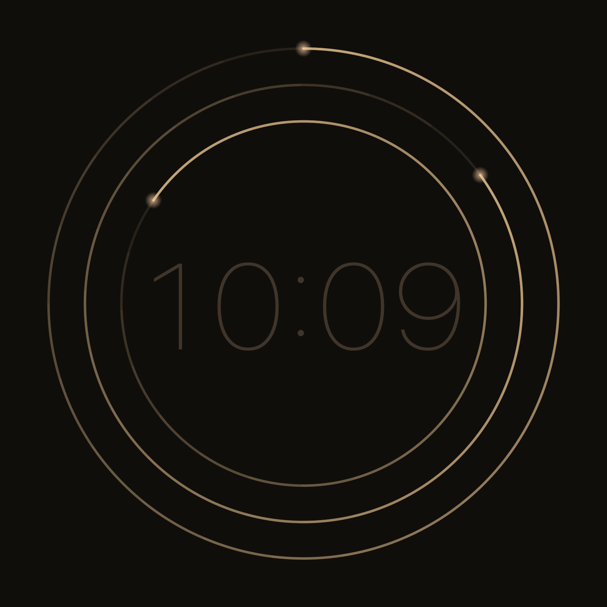
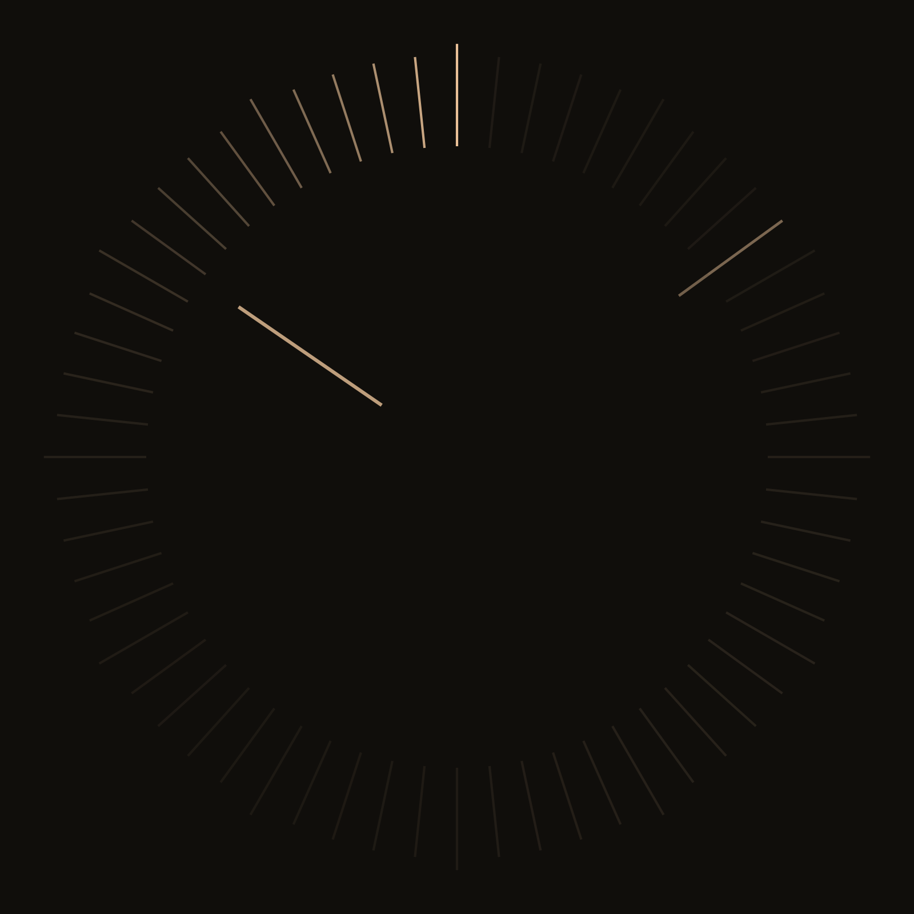
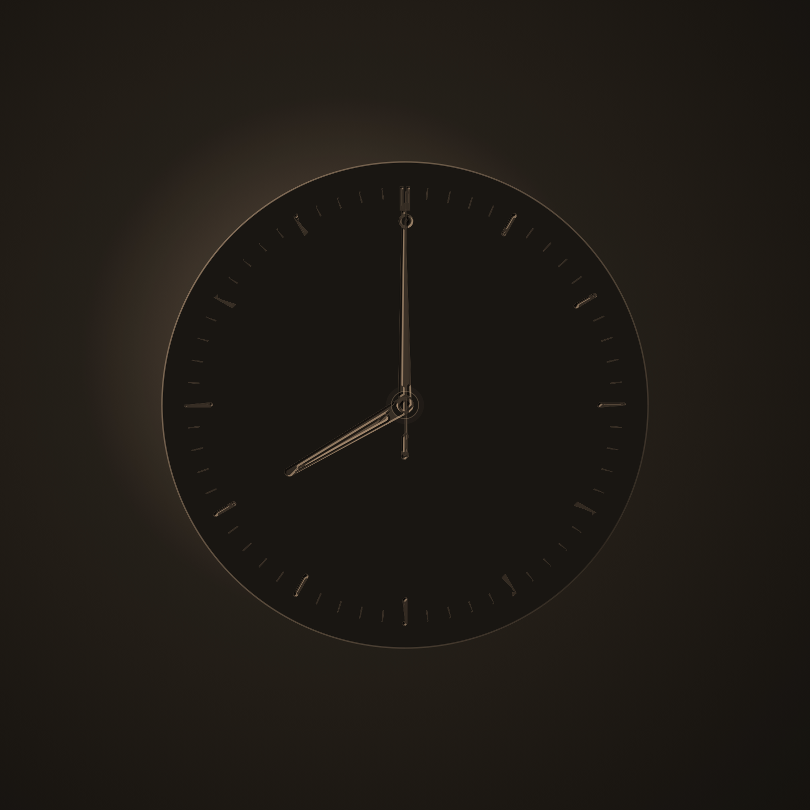
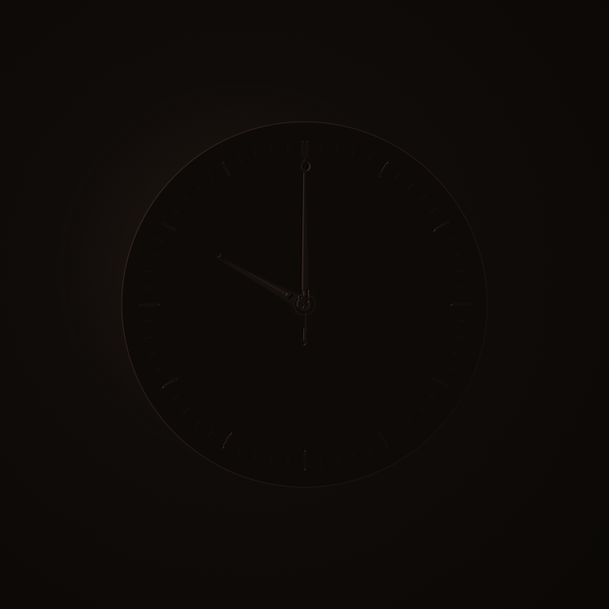

# Formzeit

A quiet macOS screensaver — a native `.saver` bundle written in Swift, built entirely from the command line with no Xcode project. Five faces, a shared day/night color system, and no Interface Builder anywhere in the settings panel.



Bauhaus (the default face): a flat-colour plate with numerals and markers pressed *into* the surface, raised white hands carrying a recessed lume channel, and a layered centre hub — on a finely grained plaster ground. Eight plates, from Lagoon through Slate.

Four alternative faces, chosen from the settings panel:

| Classic | Eclipse | Strata | Filament |
|---|---|---|---|
|  |  |  |  |

Eclipse across the day — the same face, same moment on the clock, two hours apart from each other in the diel color curve:

| 08:00 | 22:00 |
|---|---|
|  |  |

## Features

Five faces, chosen from the settings panel:

- **Bauhaus** (default) — a flat-colour plate; every mark is debossed (a pale rim on the lower-right where the recess catches the light) while hands and hub are raised and cast onto it. Eight plates: Lagoon, Pistachio, Cream, Sky, Salmon, Yellow, Beige, Slate.
- **Classic** — the original Braun BC12-inspired dial (single-ring numerals/ticks, three movements, machined-metal hand shading).
- **Eclipse** — a matte plate occludes a field of light; hands and hour marks are cuts through the plate at one of four depths, so their brightness comes from where the orbiting light source sits behind them, not from any animated highlight.
- **Strata** — three concentric hairline gauge arcs (seconds/minutes/hours), each a tail-ramp running from nearly invisible to full light at its head, with a large ultralight monospaced time readout at center.
- **Filament** — sixty radial filaments, one per second; the current second ignites to full brightness and decays over ~6s into a short comet that circles once a minute, with steady minute/hour filaments reaching further inward.

Shared across the faces:

- **A day/night color system** — a 24-hour color-and-luminance curve (the "diel curve") interpolated in Oklab so the golden-hour-to-night transition stays chromatic instead of graying out at the midpoint. Six **worlds** (Ember, Lunar, Sodium, Radium, Quartz, Duplex) re-anchor the hue family; seven **accents** (Adaptive plus six fixed hues) tint it further — Adaptive has no fixed hue of its own and just takes the color of the hour.
- **Three movements** — Quartz (1 Hz tick with a damped-spring overshoot-and-settle), Mechanical (stepped sweep), Sweep (continuous).
- 12/24-hour display and three movements, from a native settings panel with a live preview. The panel shows only the controls the selected face actually responds to — Plate for Bauhaus, World/Accent for the light-based faces — rather than leaving dead controls on screen.
- **Burn-in aware** — on Eclipse/Strata/Filament the light source itself orbits rather than translating a static image; Bauhaus and Classic drift the whole composition slowly instead. All faces ease brightness down after a long idle stretch, to a floor rather than to black.
- **Day and night** — "Follow the day" moves the light-based faces along a 24-hour colour curve. Bauhaus instead switches to its dark Slate plate overnight: multiplying a flat pastel toward black produces grey mud, not a darker mint, so it changes plate rather than dimming.

## Requirements

- macOS 12 (Monterey) or later

There are two ways to get Formzeit running. Building from source has no extra steps; downloading the prebuilt release has one required extra step, explained below.

## Option A: Download a prebuilt release (one extra step)

Grab the `.zip` from [the latest release](https://github.com/tilakp/formzeit-screensaver/releases/latest), unzip it, and drag `Formzeit.saver` into `~/Library/Screen Savers/` (create the folder if it doesn't exist).

**This is not a notarized build**, so macOS will not let it load as downloaded. This isn't a hypothetical warning — it's what actually happens, verified by simulating a real browser download end to end:

- `spctl` assesses the bundle as `rejected` (expected — it's ad-hoc signed only, no Apple Developer ID). This stays true even after the fix below; it isn't the thing that's actually blocking you.
- What *does* block it is the quarantine flag macOS attaches to anything downloaded from a browser. With that flag present, the bundle fails to load at all — selecting it in System Settings just won't show a working preview, with no error dialog explaining why.
- **The fix** is to clear that flag, which is the specific thing that's blocking it (confirmed: the bundle loads successfully immediately after this, even though `spctl` alone still reports "rejected"):

  ```sh
  xattr -dr com.apple.quarantine ~/Library/Screen\ Savers/Formzeit.saver
  ```

Then open **System Settings → Screen Saver** and select **Formzeit**.

## Option B: Build from source (no extra step, needs Xcode CLI tools)

```sh
git clone https://github.com/tilakp/formzeit-screensaver.git
cd formzeit-screensaver
./build.sh -i
```

This compiles the bundle from source, ad-hoc code-signs it, installs it to `~/Library/Screen Savers/Formzeit.saver`, and restarts the system's screensaver host processes so the new build actually gets picked up (macOS otherwise keeps a stale copy loaded in memory). Then open **System Settings → Screen Saver** and select **Formzeit**.

A build-from-source bundle never gets the quarantine flag in the first place (it was never downloaded), so it just works with no Gatekeeper step. This requires Xcode Command Line Tools — `xcode-select --install` if you don't already have `swiftc`/`clang`. A full Xcode install is not required.

> Both options produce the same ad-hoc-signed bundle. Neither is notarized, because that requires a paid Apple Developer Program membership ($99/year). The only difference between the two options is whether the file passed through a browser download and picked up a quarantine flag along the way.

## Development

- `./preview.sh [seconds] [width] [height] [--preview|--config]` — renders the current build straight to a PNG in `screenshots/`, without going through System Settings. The fast loop for iterating on the visual design. `--config` screenshots the settings sheet instead of the clock face. To preview a face other than whatever's currently saved: `defaults -currentHost write com.tilakpatel.formzeit face -string "eclipse"` (or `bauhaus`/`classic`/`strata`/`filament`) beforehand, and `defaults -currentHost delete com.tilakpatel.formzeit face` to put it back. Bauhaus plates are the `bauhausPalette` key (`lagoon`, `pistachio`, `cream`, `sky`, `salmon`, `yellow`, `beige`, `slate`).
- `./audit.sh` — a numerical audit, not a visual one: it renders the Classic dial into a bitmap and measures actual pixels (ring roundness, numeral-to-ray centering, numeral-to-tick clearance) rather than relying on eyeballing a screenshot, plus an informational Eclipse mean-frame-luminance sweep across the day/night color curve.

## How it's built

There's no `.xcodeproj`. `build.sh` drives the toolchain directly:

1. `swiftc` compiles the sources in `Sources/` with whole-module optimization to a single object file.
2. `clang -bundle` links it as a loadable bundle (the Mach-O type a `.saver` needs).
3. The object is packaged into the `Formzeit.saver` structure alongside `Info.plist`.
4. `codesign --sign -` ad-hoc signs the bundle.

`ScreenSaverView`'s `configureSheet` is a plain programmatic `NSWindow` (see `Sources/ConfigureSheetController.swift`) rather than a `.xib`, which is what makes building without Xcode possible at all.

## License

MIT — see [LICENSE](LICENSE).
