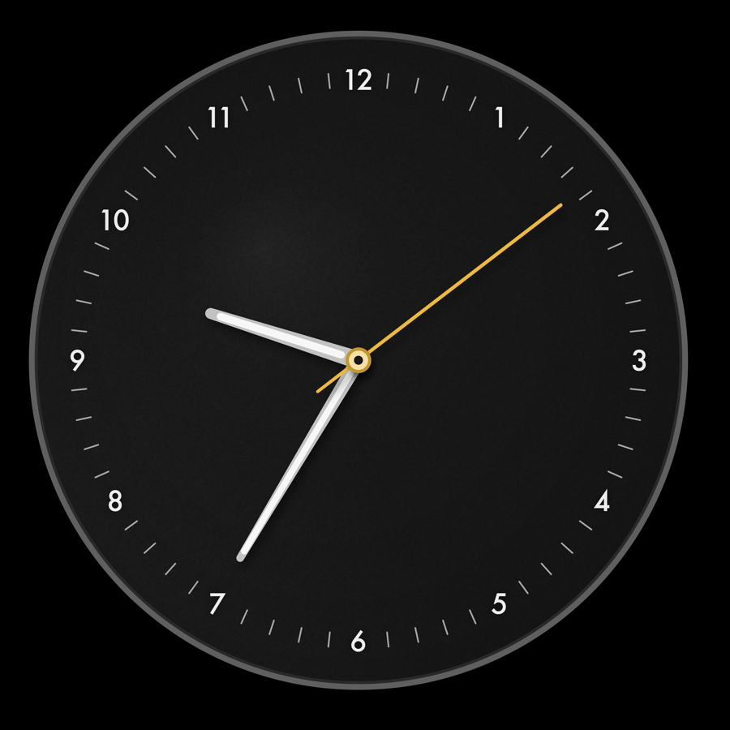

# Formzeit

A quiet, Bauhaus-inspired analog clock screensaver for macOS — a native `.saver` bundle written in Swift, built entirely from the command line with no Xcode project.

Design language borrows from the Braun BC12 wall clock: a single ring where hour numerals and minute ticks share one radial band, matte near-black dial, white hour/minute hands, and an amber-yellow sweep second hand.



## Features

- **Single-ring dial** — numerals and ticks sit in the same band, not on separate rings, so hands have real clearance and nothing crowds the rim.
- **Three movements** — Quartz (1 Hz tick with a small spring overshoot-and-settle), Mechanical (stepped sweep), Digital (continuous sweep).
- **6 curated accent colors**, 12/24-hour display, from a native settings panel (no Interface Builder).
- **Burn-in aware** — the whole face drifts slowly along an organic path, and brightness auto-dims after long idle periods, down to a floor (never fully dark, so it still reads as a clock).
- **Automatic night dimming** (10pm–7am) that eases into a soft colored glow on the hands and numerals rather than just flattening the brightness.

## Requirements

- macOS 12 (Monterey) or later
- Xcode Command Line Tools — `xcode-select --install` if you don't already have `swiftc`/`clang`. A full Xcode install is not required.

## Build & install

```sh
git clone https://github.com/tilakp/formzeit-screensaver.git
cd formzeit-screensaver
./build.sh -i
```

This compiles the bundle from source, ad-hoc code-signs it, installs it to `~/Library/Screen Savers/Formzeit.saver`, and restarts the system's screensaver host processes so the new build actually gets picked up (macOS otherwise keeps a stale copy loaded in memory). Then open **System Settings → Screen Saver** and select **Formzeit**.

> **Why build from source instead of downloading a binary?** This project isn't notarized with an Apple Developer ID. A prebuilt binary downloaded from GitHub would be quarantined by Gatekeeper and refuse to run. Building locally with `build.sh` sidesteps that — the bundle is ad-hoc signed for your machine and runs immediately, no security dialog to click through.

## Development

- `./preview.sh [seconds] [width] [height]` — renders the current build straight to a PNG in `screenshots/`, without going through System Settings. The fast loop for iterating on the visual design.
- `./audit.sh` — a geometry audit, not a visual one: it renders the dial into a bitmap and measures actual pixels (ring roundness, numeral-to-ray centering, numeral-to-tick clearance) rather than relying on eyeballing a screenshot.

## How it's built

There's no `.xcodeproj`. `build.sh` drives the toolchain directly:

1. `swiftc` compiles the sources in `Sources/` with whole-module optimization to a single object file.
2. `clang -bundle` links it as a loadable bundle (the Mach-O type a `.saver` needs).
3. The object is packaged into the `Formzeit.saver` structure alongside `Info.plist`.
4. `codesign --sign -` ad-hoc signs the bundle.

`ScreenSaverView`'s `configureSheet` is a plain programmatic `NSWindow` (see `Sources/ConfigureSheetController.swift`) rather than a `.xib`, which is what makes building without Xcode possible at all.

## License

MIT — see [LICENSE](LICENSE).
